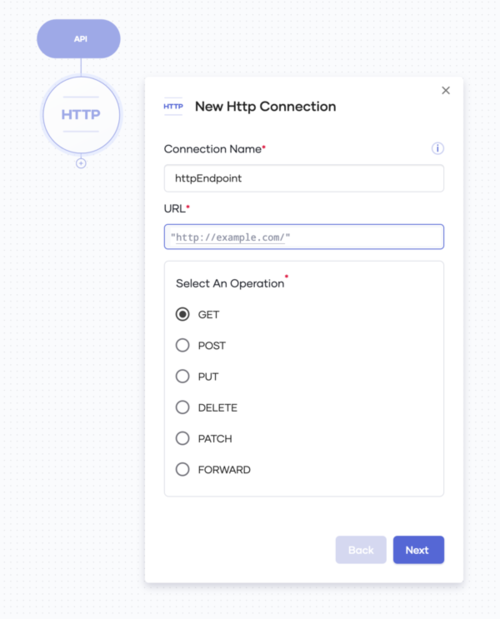

# Choreo APIs/Connectors 

## Table of Contents 
<!--ts-->
* [Introduction](#Introduction)  
* [Generic Protocol based APIs](#Generic-Protocol-based-APIs)
* [Application Specific APIs](#Application-specific-APIs)

<!--te-->

## Introduction 

Choreo lets you connect to external services through your Choreo application. This allows you to perform integrations using Choreo.

Once you create an application and select a trigger, you will be presented with the Choreo application develop view. In this view, you may select an external API to connect to.

There are two basic types of APIs.    

1- Generic protocol based  APIs   

2- Application specific APIs

## Generic Protocol based  APIs

These are APIs based on generic protocols that you can configure to connect to an external service. These include  
 * HTTP  
 * SMTP  
 * POP3  
 * IMAP 

### Example - HTTP
The HTTP API lets you communicate with an external endpoint using the HTTP protocol. 

## Application Specific APIs

These APIs can be used to connect to a given external application. Hence they contain only application based configurations.
  * GitHub
  * Gmail
  * Google Calendar
  * Google Sheets
  * Twilio

### Example - Twilio

Twilio API allows you to integrate your Choreo application with Twilio (https://www.twilio.com/)

