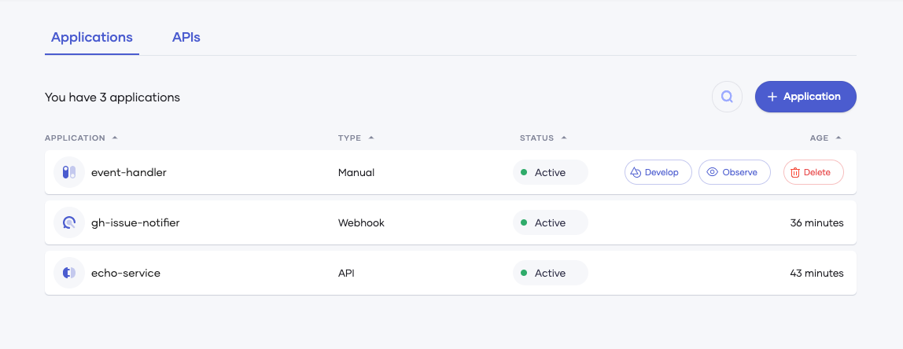
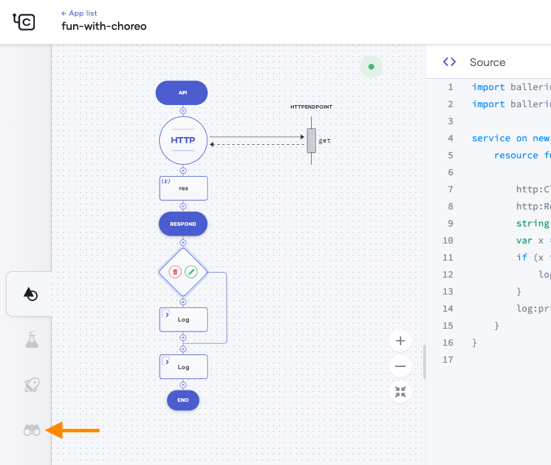
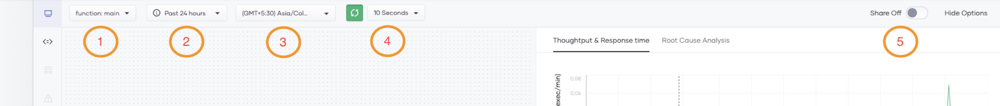
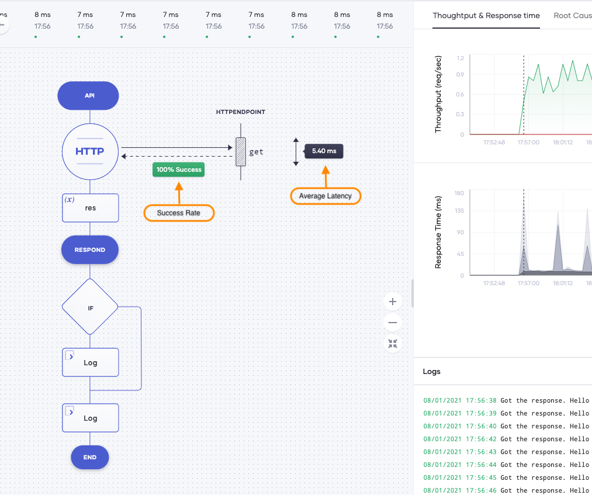
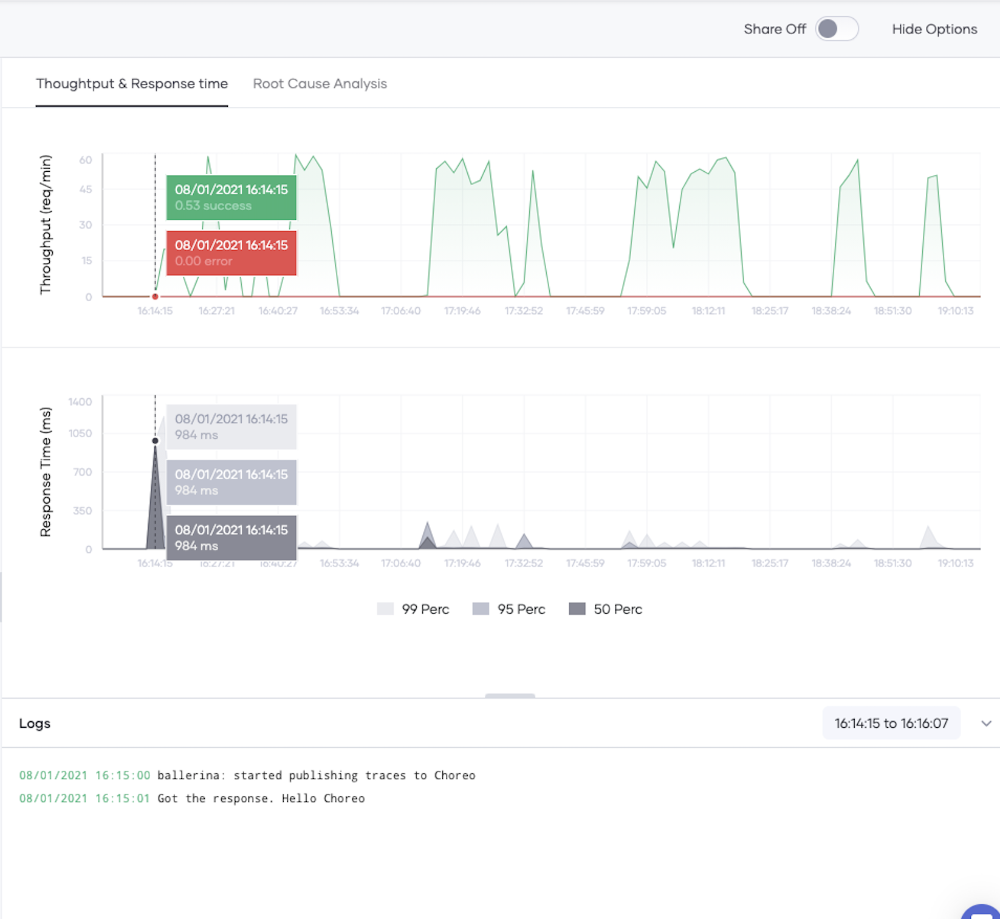

# Choreo Observability

## Table of Contents
<!--ts-->
* [Introduction](#Introduction)

* [Navigate to the Observability Page](#Navigate-to-the-Observability-Page)
  * [Options bar in observability view](#Options-bar-in-observability-view)
* [Observe Application Metrics](#Observe-Application-Metrics)
* [Tracing requests](#Tracing-requests)
* [View Logs](#View-Logs)
* [Root Cause Analysis](#Root-Cause-Analysis)
   * [Flame Graph](#Flame-Graph)
   * [What’s next?](#What’s-next?)

<!--te-->

## Introduction

Choreo Observability features allow you to observe any deployed application without any hassle. Choreo Observability allows you to view the overall status of your applications, drill down to the level of requests and even help you to find the root cause of issues in your applications.

## Navigate to the Observability Page

You can get to observability in two ways:

First, when you are at the application list (where you go in when you log in), you hover over an app in the App List page, it will show the observe button. Clicking on it will take you to the Choreo Observability page.

Second, you will find an observe button on the left side of your application page which can be used to navigate to the observability page.

Once you reach the observability page, you will see a screen similar to the following. You use the view to

1- Observe application metrics  
2- Tracing requests  
3- View low code diagram along with observations  
4- View Logs  
5- Navigate to the logs view  
6- Navigate to the root cause analysis view  
Within a single screen as annotated in below.  

We will discuss each of them below. 

*Note: If your application has not received any requests or has never got invoked, you will see the “No requests received during the selected time period” message instead of graphs*

### Options bar in observability view

You will see the options bar at the top of the observability page. There, by changing the values provided by the dropdown menus, certain configurations could be changed as follows.

1- Change the resource, remote or function you need to observe  
2- Change the time window of throughput and latency graphs  
3- Change the timezone of throughput,latency graphs and the logs view  
4- Change the refresh interval  
5- Turn sharing on/off  

By default your observability view is private, and therefore is only visible to the application owner. But if you want to share it with others, you can simply toggle the share off switch and share the link.

## Observe Application Metrics

You will see throughput and latency graphs at the top right of the observability page. By default, graphs are rendered for the data generated within the past 24 hours. 

You have the option to change the default time window either by using the dropdown menu or by selecting the desired time range in any of the two graphs. This allows you to find the throughput and latency of your application at a given timestamp, at a glance.

When you change the time window, the unit of the y-axis of the throughput graph will change accordingly.

*Note: Data display in these two graphs vary based on the application type.* 

| Application type | Throughput graph                    | Latency graph                      |
|------------------|-------------------------------------|------------------------------------|
| Service          | Requests received for a unit time   | Time taken to complete a request   |
| Function         | Executions performed in a unit time | Time taken to perform an execution |

## Tracing requests

You can trace the requests received by your application at a given timestamp by selecting the desired time in the time axis of either the throughput or the latency graph. It will show the received requests along with the request time, latency and the status. You will even be able to view the status code and the latency for the http connector of a single request, when you click on a particular request.

Furthermore, the lowcode diagram will display the average latency and the success rate corresponding to any given timestamp that you select from the graphs. 

## View Logs

1- Correlate logs with throughput and latency graphs

Let's say you identified a high latency in the latency graph and you want to see the corresponding log entries for the timestamp of that particular latency. What you have to do is, just click on the timestamp that you are interested in on the latency or throughput graph. The relevant log entries will appear in the Logs panel situated right underneath the two graphs.

2- View/Filter logs of the entire application

In case you want to find all the logs in your application, you can visit the logs panel by clicking on the logs button at the top left side of the observability page. There, you can easily filter the logs for a given duration using the dropdown menus provided in the Options Bar. Furthermore, you can quickly filter logs based on a certain log phrase by simply providing it in the Contains search box.

You can also download the log entries using the download button and it will save the log entries as a .txt file in your machine.

## Root Cause Analysis

Root cause analysis view provides everything that you need to debug your application in a single place. It is a very simple but powerful view to find the root cause of a problem in a few seconds. 

The Root Cause Analysis view will contain five equally divided bins based on the time window provided in the Options Bar. In the Logs column against each Date/Time window, the most five unique log entries that have been printed between that bin’s start time and the end time are displayed. Here the logs are having a precedence, where it will first show the error logs and then the info logs. Also the log count is displayed at the end of each log entry. Error, TP, Latency, CPU and Memory graphs in the remaining columns, display the variation of HTTP error count, Throughput, Latency, CPU usage and Memory usage respectively for the time duration of each bin.

### Flame Graph

Let's say you have identified an anomalous behaviour by observing the root cause analysis view. You can deep dive further to determine the root cause by referring to the latency flame graph where you can find the exact resource/function causing the issue by investigating the elapsed times shown in the flame graph. 

To access the flame graph, move the selection box to the desired area and click the green flame graph button at the right bottom corner of the selection box.

Now you have the latency flame graph for the time period that you have selected from the previous view. You can further move/adjust the selection and get what you exactly wanted as depicted below.

In the flame graph, the Y-axis represents the stack depth and the X-axis represents latency. A box in the graph represents a stack frame. Its label pinpoints to the location of the corresponding statement in your code. The length of a box is proportional to the execution latency of the statement. Boxes above it represent its ancestors and those below represent its children.

In fact, this is a variant of flame graphs called "Icicle chart" where the top most stack frame is the root stack frame and the graph is read from top to bottom.

With flame graphs you can find the exact locations in your code which cause higher latencies and improve as required.

### What’s next?

Let's say you finally found the root cause by referring to the graphs and logs provided in the root cause analysis view. It could be due to a logical error in your program, insufficient resource allocation, exceeded throttling limits, invalid configuration or any other reason.
In case the problem is an insufficient resource allocation or hitting the throttling limits, you can get it solved by simply contacting the Choreo team through the help center.