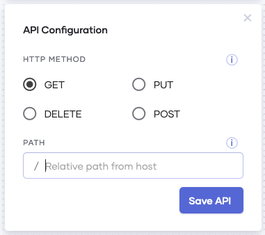

# Relative Path From Host

## Table of Contents
<!--ts-->

* [Introduction](#Introduction)

  * [1-Empty path](#1-Empty-path)
  * [2-Single path](#2-Single-path)
  * [3-Multiple path Strings](#3-Multiple-path-Strings) 
  * [4-Path Parameters](#4-Path-Parameters)
  * [5-Query Parameters](#5-Query-Parameters)

<!--te-->

## Introduction 

When creating a Choreo application with an API trigger, the Relative path from host field allows you to specify the path used to trigger the Choreo application. It could also be used to pass path parameters to your application.

Suppose you create a Choreo application named sample with an API trigger. 

Once you deploy the application, you will receive a hostname as follows.
https://sample-username.choreoapps.dev

The URL that you need to invoke to trigger the application changes as follows based on the Relative path from host field that you specify.

### 1-Empty path
If you leave this field blank, invoking the hostname triggers the choreo application. 

E.g.
Relative path from host: empty
Trigger URL: https://sample-username.choreoapps.dev

### 2-Single path
If you provide a single path for this field, you need to append it to the hostname to invoke your application.

E.g.
Relative path from host: /path1
Trigger URL: https://sample-username.choreoapps.dev/path1

### 3-Multiple path Strings 
You could also provide multiple paths for this field. If you do so, you need to append them to the hostname to invoke your application.

E.g.
Relative path from host: /path1/path2/path3
Trigger URL: https://sample-username.choreoapps.dev/path1/path2/path3

### 4-Path Parameters
When a path parameter is specified, it could be read from within your Choreo application. This allows you to read values provided within the path 

Format: [<data type> <parameter name>]

E.g. 
Relative path from host: /[int date]/[string day]
Trigger URL: https://sample-username.choreoapps.dev/8/monday

This allows you to read the value of date; “8” and day; “monday” within your Choreo application

### 5-Query Parameters

 
