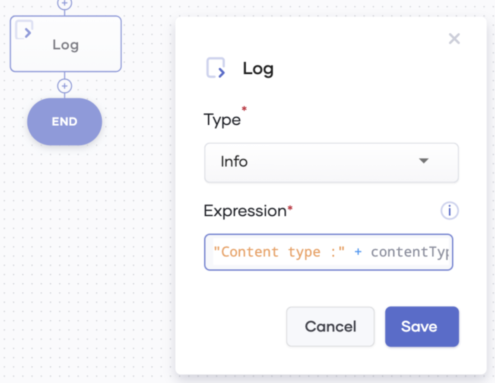
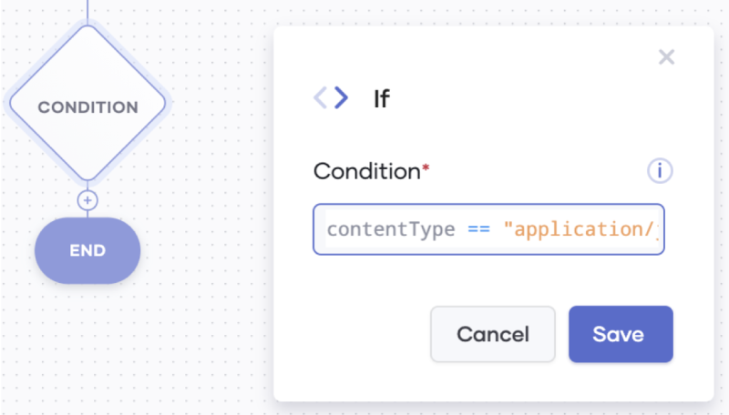
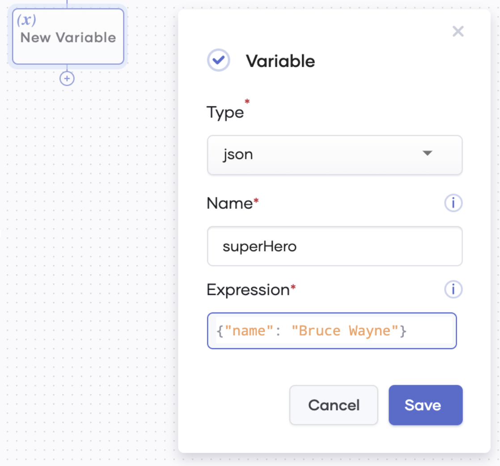
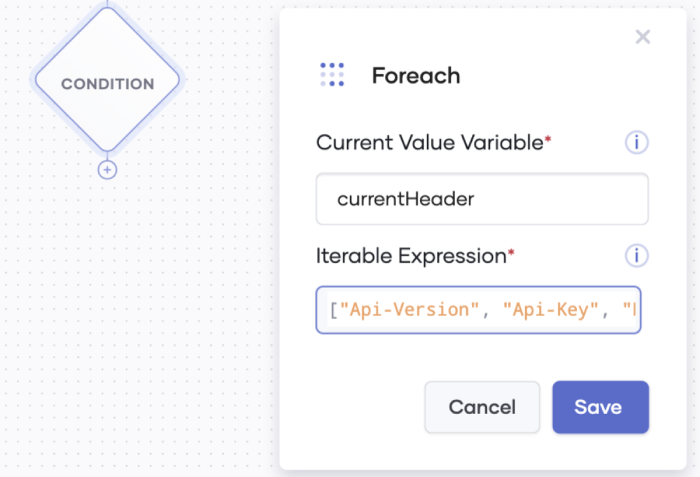
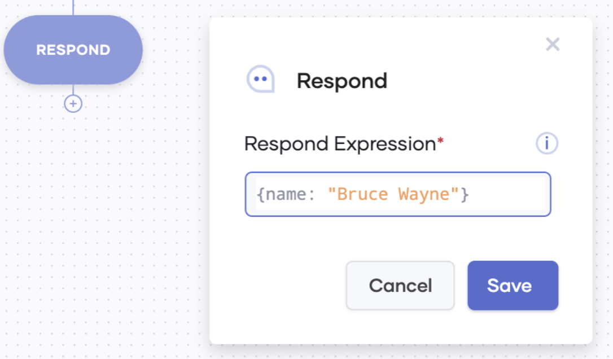
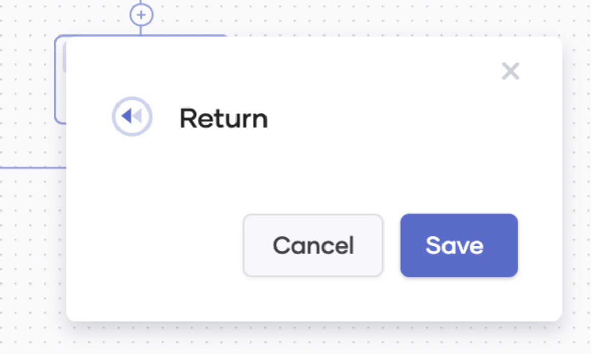

# Choreo Statements 

## Table of Contents 
<!--ts-->

* [Introduction](#Introduction)  
* [Log statement](#Log-statement)
* [If conditional statement](#If-conditional-statement)
* [Variable statement](#Variable-statement)
* [For-each iteration statement](#For-each-iteration-statement)
* [Respond statement](#Respond-statement)
* [Return statement](#Return-statement)

<!--te-->

## Introduction 

A statement is a syntactic unit that specifies the action to be carried out in a Choreo application. 

Choreo supports the following statements in the graphical editor:

 * Log  
 * If conditional statements  
 * Variable  
 * For-each iterations
 * Respond
 * Return

### Log statement

You can use the log statement to add an entry to the application log at runtime. When you add a log statement, you can select either **Info** or **Error** as the **Type** depending on your requirement.

 

### If conditional statement

You can use the if conditional statement to execute a specific collection of statements if a specified condition is met, and to execute another set of statements if the condition is not met.

### Variable statement

You can use the variable statement to declare a variable. There are two approaches you can follow to declare a variable:
 * Define a variable as **var** type (corresponds to the `var` keyword in Ballerina) followed by the name and an initializer expression. 
 * Select an appropriate variable type from the drop down list.

### For-each iteration statement

You can use the for-each iteration statement to traverse through items of a collection of data. e.g., to traverse through arrays, maps, JSON, XML, and tables. 

### Respond statement

You can use the respond statement when you want the Choreo application to send a response back to its client. For example, to get an API to respond with a `HTTP_OK` indicating that the request is successfully processed.

### Return statement

You can use the return statement to end the ongoing execution of a Choreo application.

