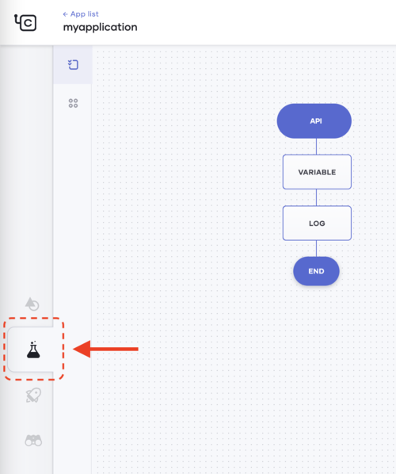
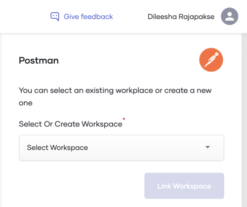
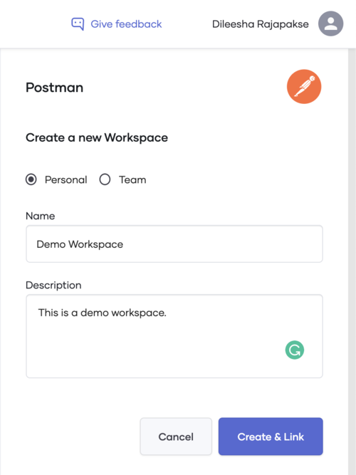
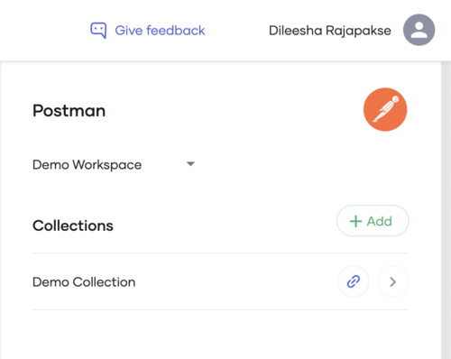

# Choreo Test View 

## Table of Contents
<!--ts-->

* [Introduction](#Introduction)

* [Prerequisites](#Prerequisites)
* [Choreo Postman Editor](#Choreo-Postman-Editor)
  * [Getting started](#Getting-started)
  * [Create or Open an Existing Application](#Create-or-Open-an-Existing-Application)
   * [Connecting Postman to Choreo](#Connecting-Postman-to-Choreo)
   * [Generate a Postman API Key](#Generate-a-Postman-API-Key)
   * [Saving Postman Key in Choreo](#Saving-Postman-Key-in-Choreo)
   * [Create and Link a Workspace](#Create-and-Link-a-Workspace)
   * [Create a Collection](#Create-a-Collection)
   * [Create a Request](#Create-a-Request)

<!--te-->

## Introduction 

This document is a step-by-step guide on using the Postman Editor of the Choreo console to manage Postman workspaces, collections and requests. 

## Prerequisites 
Make sure you have logged into the Choreo console and created an application.
An active Postman account is required.

## Choreo Postman Editor
The postman Editor integrates with your postman account to facilitate an easier way to create and test your Choreo application. You can,

1- Create and link postman workspaces with Choreo.
2- Create collections and requests for an application.

All requests/collections/workspaces created will immediately be visible in your postman account.

Note: you need to send requests to Choreo application using postman agent.

### Getting started

### Create or Open an Existing Application
Log into the Choreo console and create an application. To create an application, follow our application creation guide.

### Connecting Postman to Choreo

### Generate a Postman API Key

1- A Postman API key is required to connect your Postman account to the console. To generate an API key, go to  Postman API Keys page.

2- Click on the Generate API Key button.

3- Enter a name for your API Key and click on the Generate API Key button.

4- An API key will be generated and shown in the next pop up window. Make sure to copy this API key and keep it somewhere safe.

### Saving Postman Key in Choreo

1- Go to the test view of the Choreo console by clicking on the test view tab.

2- On the right side of the console, the Postman Editor’s welcome page will be displayed. Click on Click here to add your Postman API key to the console.

3- Enter the Postman API key generated in earlier steps into the API Key text box. Once entered, the API key will be validated and a success message will be shown. Click on Save to save your API key.

### Create and Link a Workspace

1- Once the API key is saved, you will be prompted to create a new workspace or select an existing workspace. The workspaces which are already available in your postman account will be shown in the drop-down list and you may choose any of your existing workspaces as well.

2- To create a new workspace, click on + Create New option from the drop-down list.

### Create a Collection

1- Once the workspace is created or an existing workspace is selected, the Collections view will be shown. In this panel, you can create a new collection and also, view existing collections in your Postman account. You can also switch your workspace in this view.

2- Click on + Add button to create a new collection. Enter collection details and click on Create.

3- A collection will be created and displayed on the Collections panel.

### Create a Request

1- Click on the collection you’ve created and the Requests panel will be displayed. Click on + Add to create a new request.

2- In this view, you can create a new request by specifying request details such as name, description, HTTP method, query params, headers and body.

3- You can add headers, a body of any type as well. Once done, click on Save.

4- A new request will be created and displayed on the requests view.

5- If you log into your Postman account through the browser or the desktop client, you may see the workspace, collection and requests created via the console.

(Notice the request URL has been automatically set by Choreo to the application’s URL)
 

